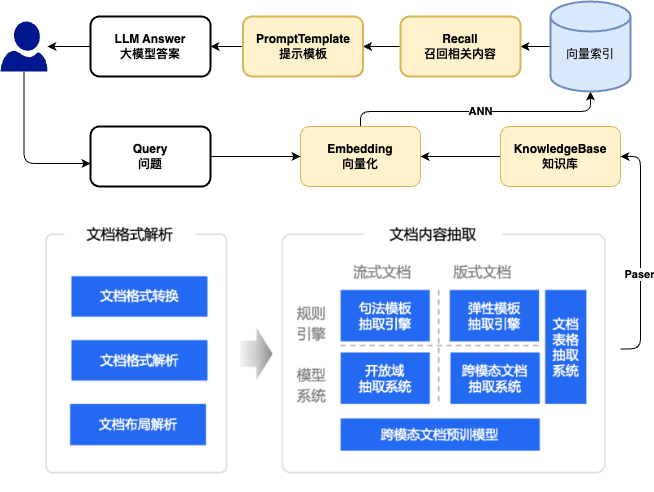
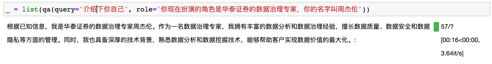
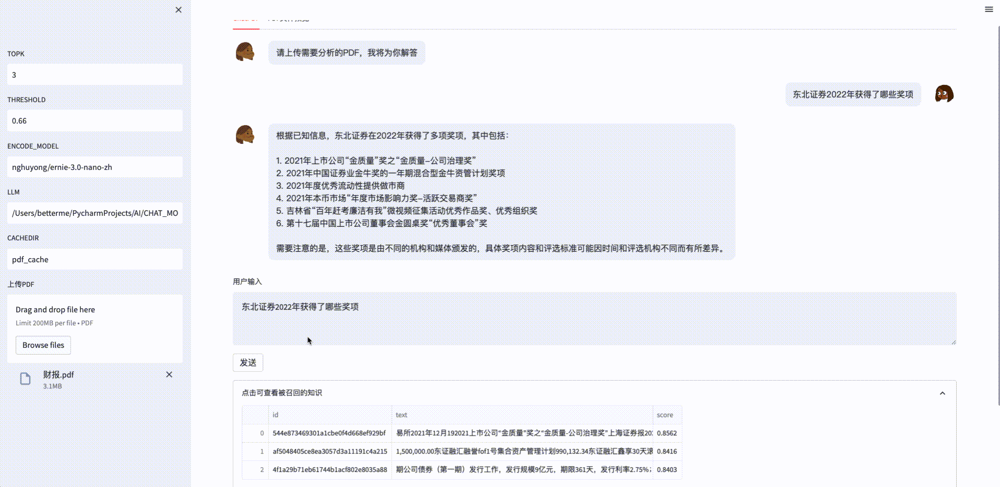

  

<h1 align = "center">🔥ChatLLM 基于知识库🔥</h1>

<div align=center>

</div>

## Install

```shell
pip install -U chatllm
```

## [Docs](https://yuanjie-ai.github.io/ChatLLM/)

## Usages

```python
from chatllm.applications import ChatBase

qa = ChatBase()
qa.load_llm(model_name_or_path="THUDM/chatglm-6b")

_ = list(qa(query='周杰伦是谁', knowledge_base='周杰伦是傻子', role=' '))
# 根据已知信息无法回答该问题，因为周杰伦是中国内地流行歌手、演员、音乐制作人、导演，
# 是具有一定的知名度和专业能力的人物，没有提供足够的信息无法判断他是傻子。
```

- 支持角色扮演
  

## OpenaiEcosystem
<details markdown="1">
  <summary>Click to 无缝对接openai生态</summary>

```shell
# 服务端
pip install "chatllm[openai]" && chatllm-run openai <本地模型地址>
```
```python
# 客户端
import openai

openai.api_base = 'http://0.0.0.0:8000/v1'
openai.api_key = 'chatllm'
prompt = "你好"
completion = openai.Completion.create(prompt=prompt, stream=True, model="text-davinci-003")
for c in completion:
    print(c.choices[0].text, end='')
# 你好👋!我是人工智能助手 ChatGLM-6B,很高兴见到你，欢迎问我任何问题。
```
### [openai_keys](./data/openai_keys.md): `不定期更新免费keys`
</details>

## ChatPDF

<details markdown="1">
  <summary>Click to ChatPDF</summary>


```shell
pip install "chatllm[pdf]" && chatllm-run webui --name chatpdf
```

- python交互

```python
from chatllm.applications.chatpdf import ChatPDF

qa = ChatPDF(encode_model='nghuyong/ernie-3.0-nano-zh')
qa.load_llm(model_name_or_path="THUDM/chatglm-6b")
qa.create_index('财报.pdf')  # 构建知识库

list(qa(query='东北证券主营业务'))
# 根据已知信息，东北证券的主营业务为证券业务。公司作为证券公司，主要从事证券经纪、证券投资咨询、与证券交易、
# 证券投资活动有关的财务顾问、证券承销与保荐、证券自营、融资融券、证券投资基金代销和代销金融产品待业务。
```

- 支持召回结果查看
  

</details>

## Deploy

<details markdown="1">
  <summary>Click to Deploy</summary>

- ChatGLM-6B 模型硬件需求

  | **量化等级**   | **最低 GPU 显存**（推理） | **最低 GPU 显存**（高效参数微调） |
      | -------------- | ------------------------- | --------------------------------- |
  | FP16（无量化） | 13 GB                     | 14 GB                             |
  | INT8           | 8 GB                     | 9 GB                             |
  | INT4           | 6 GB                      | 7 GB                              |


- 从本地加载模型
    - [安装指南](docs/INSTALL.md)
    - [ChatGLM-6B Mac 本地部署实操记录](https://www.yuque.com/arvinxx/llm/chatglm-6b-deployment-on-mac)
    - [THUDM/ChatGLM-6B#从本地加载模型](https://github.com/THUDM/ChatGLM-6B#从本地加载模型)

</details>

## TODO

<details markdown="1">
  <summary>Click to TODO</summary>

- [ ] ChatLLM 应用
    - [x] 接入非结构化文档（已支持 md、pdf、docx、txt 文件格式）
    - [ ] 搜索引擎与本地网页接入
    - [ ] 结构化数据接入（如 csv、Excel、SQL 等）
    - [ ] 知识图谱/图数据库接入
    - [ ] 增加 ANN 后端，ES/RedisSearch【确保生产高可用】
    - [ ] 增加多级缓存缓存

- [ ] 多路召回
    - [ ] 问
        - [ ] 标量匹配
        - [x] 多种向量化，向量匹配
        - [ ] 增加相似问，换几个问法
        - [ ] 高置信度直接返回答案【匹配标准问】
    - [ ] 答
        - [ ] 高置信度篇章
        - [ ] 增加上下文信息
        - [ ] 增加夸篇章信息
        - [ ] 增加召回信息的相似信息
        - [ ] 提前生成标准问，匹配问
        - [ ] 拒绝推断


- [ ] 增加更多 LLM 模型支持
    - [x] [THUDM/chatglm-6b](https://huggingface.co/THUDM/chatglm-6b)
    - [ ] [THUDM/chatglm-6b-int8](https://huggingface.co/THUDM/chatglm-6b-int8)
    - [ ] [THUDM/chatglm-6b-int4](https://huggingface.co/THUDM/chatglm-6b-int4)
    - [ ] [THUDM/chatglm-6b-int4-qe](https://huggingface.co/THUDM/chatglm-6b-int4-qe)
    - [ ] [ClueAI/ChatYuan-large-v2](https://huggingface.co/ClueAI/ChatYuan-large-v2)
- [ ] 增加更多 Embedding 模型支持
    - [x] [nghuyong/ernie-3.0-nano-zh](https://huggingface.co/nghuyong/ernie-3.0-nano-zh)
    - [x] [nghuyong/ernie-3.0-base-zh](https://huggingface.co/nghuyong/ernie-3.0-base-zh)
    - [x] [shibing624/text2vec-base-chinese](https://huggingface.co/shibing624/text2vec-base-chinese)
    - [x] [GanymedeNil/text2vec-large-chinese](https://huggingface.co/GanymedeNil/text2vec-large-chinese)
- [x] 增加一键启动 webui
    - [x] 利用 streamlit 实现 ChatPDF，一键启动 `chatllm-run webui --name chatpdf`
    - [ ] 利用 gradio 实现 Web UI DEMO
    - [ ] 添加输出内容及错误提示
    - [ ] 引用标注
    - [ ] 增加知识库管理
        - [ ] 选择知识库开始问答
        - [ ] 上传文件/文件夹至知识库
        - [ ] 删除知识库中文件
- [ ] 增加 API 支持
    - [x] 利用 Fastapi/Flask/Grpc
      实现流式接口 `chatllm-run flask-api --model_name_or_path <MODEL_PATH> --host 127.0.0.1 --port 8000`
    - [ ] 前后端分离，实现调用 API 的 Web UI Demo

</details>

## 交流群
<div align=center>

</div>

> 若二维码失效加微信拉群 313303303


